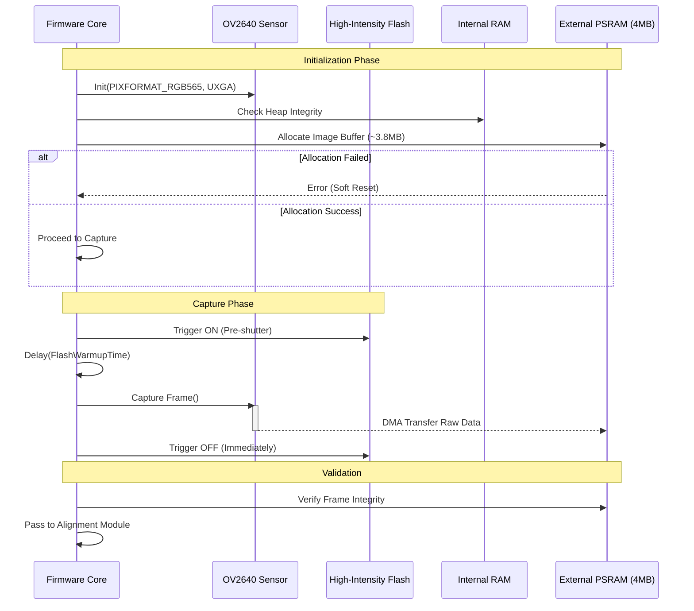
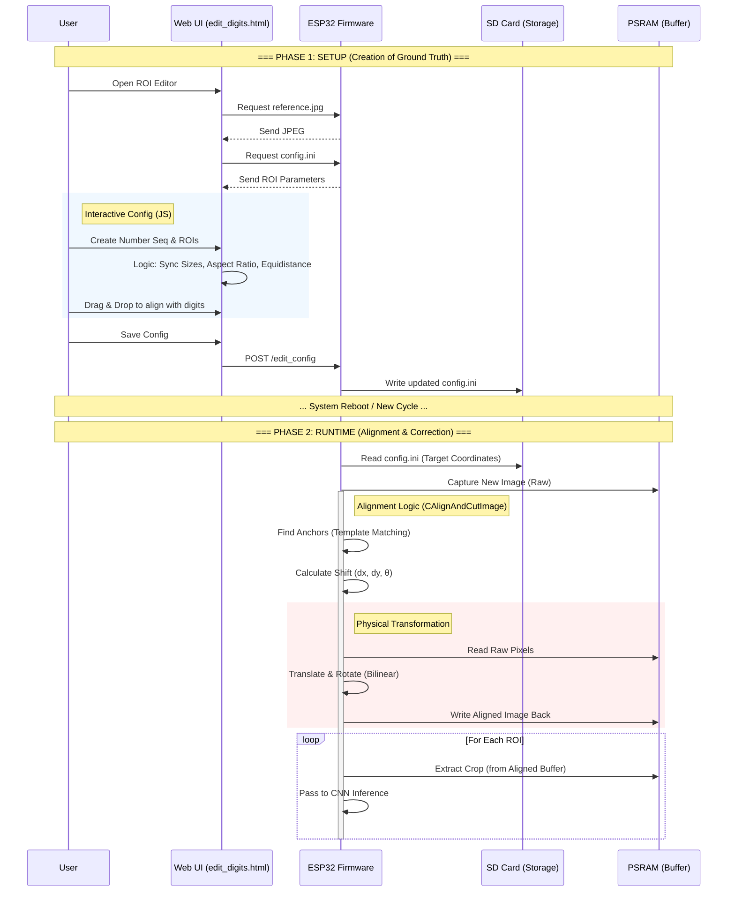

# System Analysis Diagrams (ana1.md)

## 1. Image Acquisition Process (ClassFlowTakeImage)

This diagram details the critical steps for capturing high-quality input data, emphasizing synchronization and memory management on the resource-constrained ESP32.

## 2. ROI Lifecycle: Configuration & Alignment

This diagram illustrates the complete lifecycle of the Region of Interest (ROI) system, from the user manually defining coordinates on the Web UI to the firmware physically aligning the image in real-time.

