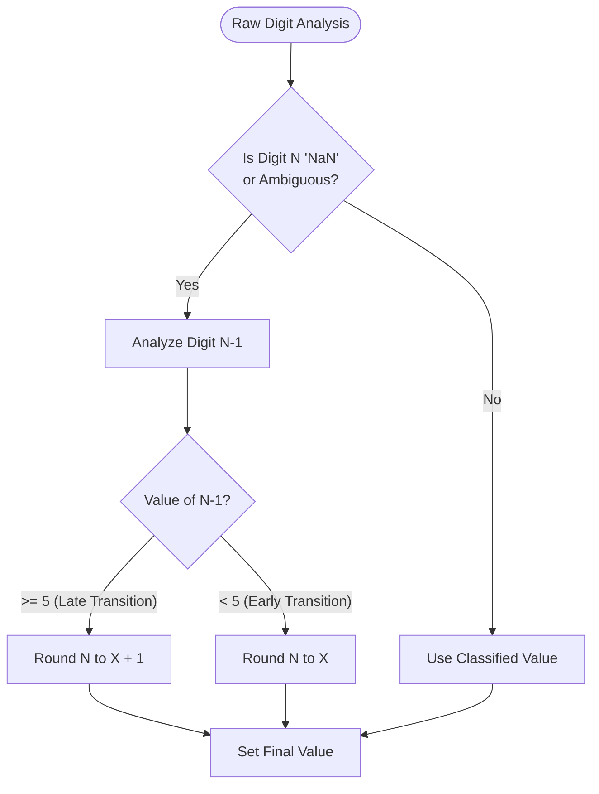
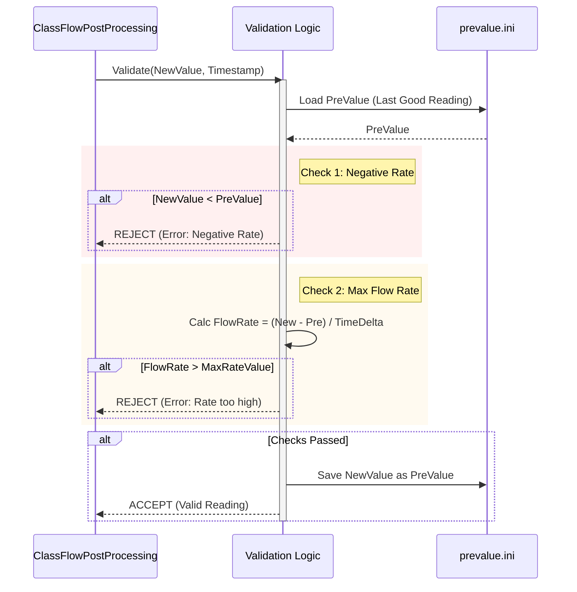
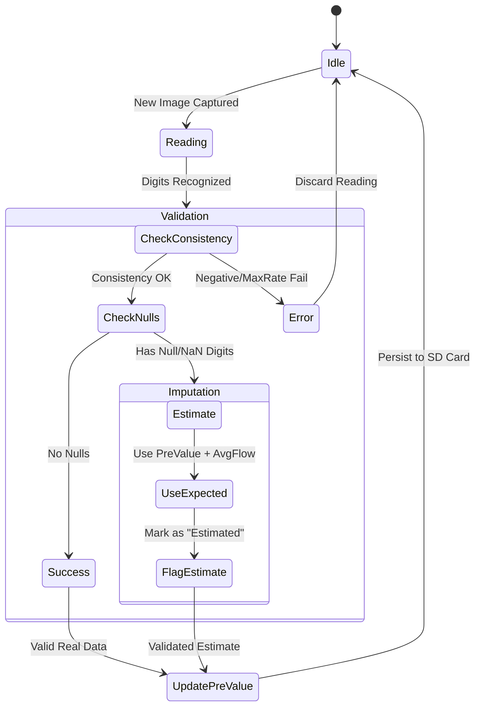

# Anomaly Detection & Data Processing Diagrams

## 1. Digit Sequence Validation (Odometer Logic)

This flowchart illustrates how the system resolves ambiguous "NaN" (half-state) digits by analyzing the status of the lower-significance digit (N-1).

## 2. Rule-Based Anomaly Detection Pipeline

This sequence details the strict physical validation rules applied to every new reading to prevent billing errors.

## 3. Temporal Consistency & Imputation

This state diagram shows the system's lifecycle for maintaining data integrity and handling persistent read failures.

