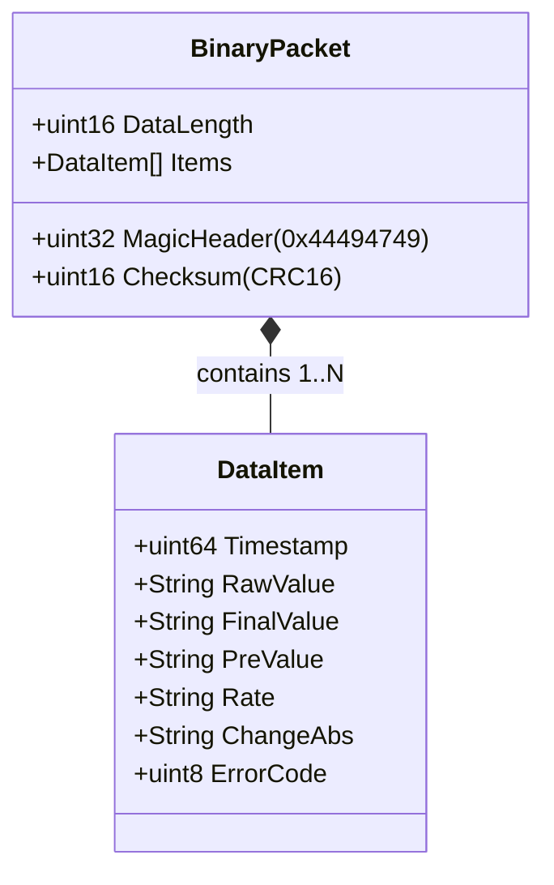
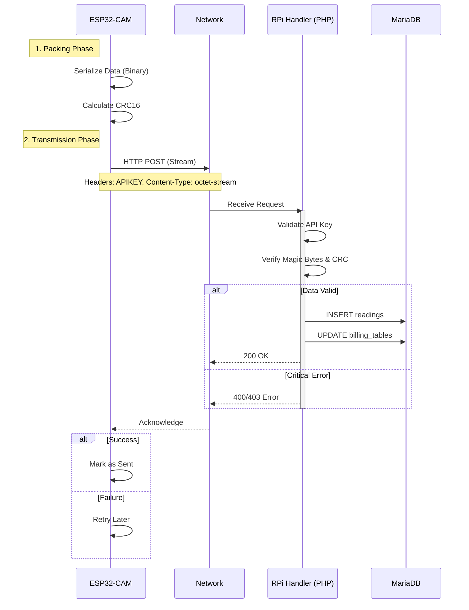

## 1. Binary Protocol Structure

The system uses a custom binary protocol to optimize bandwidth, reducing payload size by ~60% compared to JSON.

## 2. Webhook Transmission Sequence

This diagram illustrates the streamlined process of the ESP32 transmitting telemetry data to the PHP backend.

