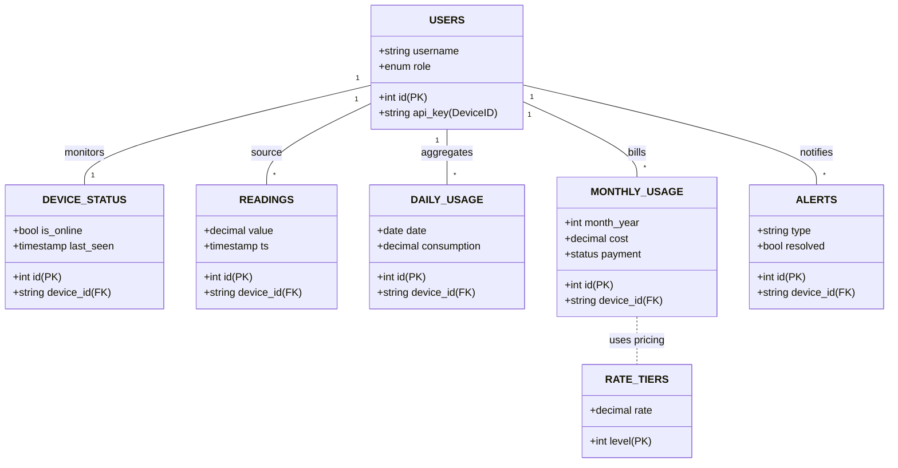

# Database Schema & Relationships

## 1. Entity Relationship Diagram (ERD)

This diagram visualizes the structure of the MariaDB relational database `iotdigi_db`.

- **Device Identity**: The `users` table holds authentication data and maps physical devices (via `api_key`) to accounts.
- **Telemetry**: The `readings` table acts as the high-velocity ingestion point.
- **Aggregation**: `daily_usage` and `monthly_usage` are derived tables used for rapid querying of historical data and billing without scanning millions of raw rows.
- **Configuration**: `rate_tiers` defines the pricing logic applied to `monthly_usage`.

## 2. Table Functional Definitions

| Table Name          | Primary Purpose                                 | Update Frequency                       | Data Retention            |
| :------------------ | :---------------------------------------------- | :------------------------------------- | :------------------------ |
| **`users`**         | Identity Management (Auth/Device Mapping)       | Low (Registration only)                | Permanent                 |
| **`readings`**      | Raw Telemetry Log (Source of Truth)             | Very High (Every 5-15 min)             | High (e.g., 2 years)      |
| **`daily_usage`**   | Optimized daily aggregation for charting        | Medium (Daily batch/Real-time trigger) | Permanent                 |
| **`monthly_usage`** | Billing statements & Tiered Pricing calculation | Low (Monthly/On-change)                | Permanent                 |
| **`alerts`**        | Exception logging (Leaks, Tampering)            | Burst (Event-driven)                   | Medium (User resolved)    |
| **`rate_tiers`**    | Pricing Configuration (Admin managed)           | Very Low (Annual pricing updates)      | Permanent                 |
| **`device_status`** | Health Monitoring (Heartbeat)                   | High (Updated on every reading)        | Ephemeral (Current state) |
