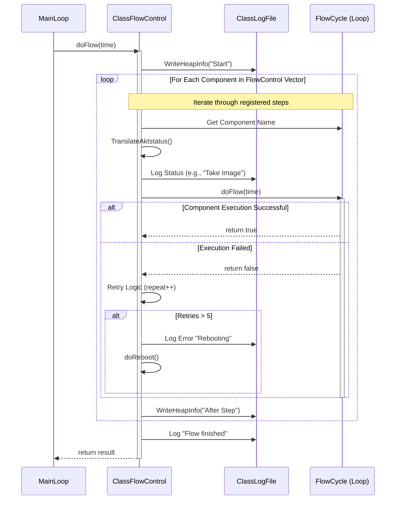
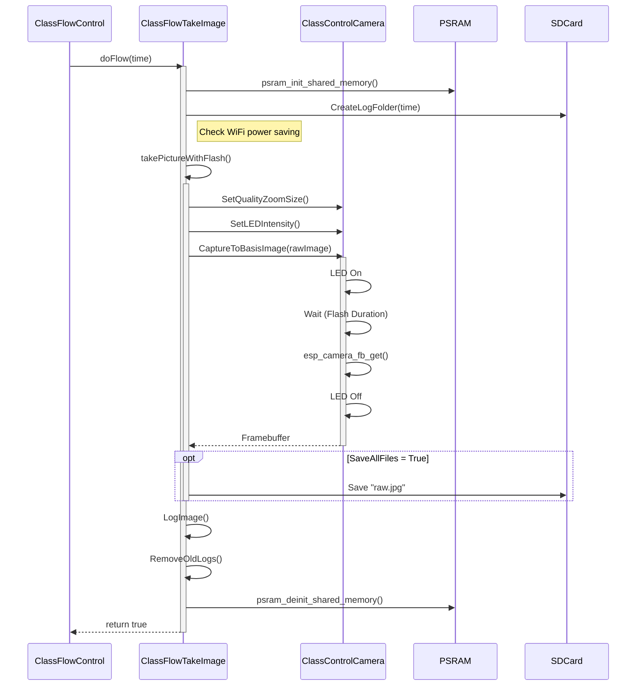
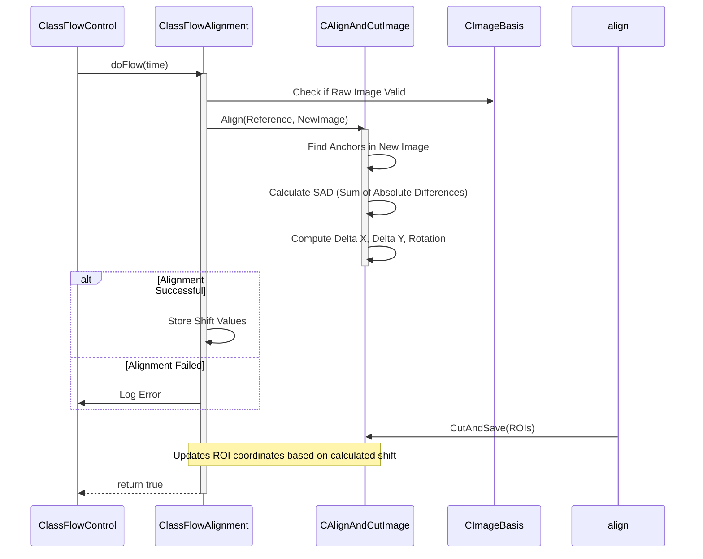
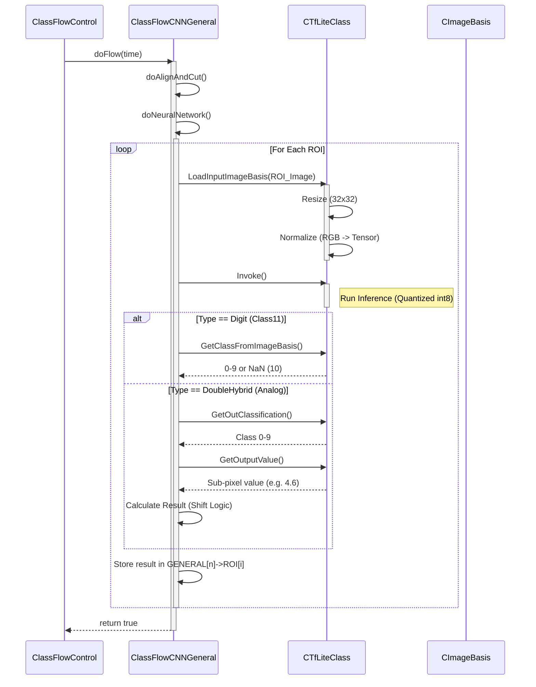
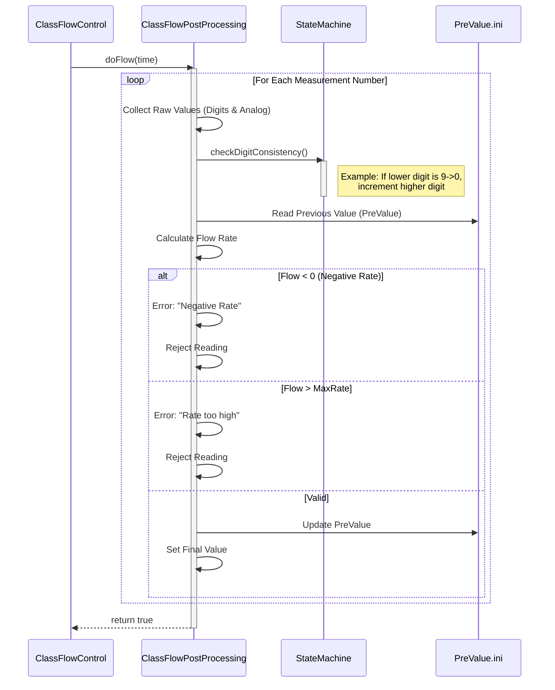

# ESP32-CAM Firmware Flow Control Diagrams

## 1. Main System Flow (FlowControl)

This diagram illustrates the high-level orchestration performed by `ClassFlowControl`. It iterates through the registered flow components (TakeImage, Alignment, Digit/Analog CNN, PostProcessing, Webhook) and executes them sequentially.

## 2. Image Capture Flow (TakeImage)

This diagram details the `ClassFlowTakeImage` process, including handling the flash, capturing the raw frame from the OV2640 sensor, and saving it to the SD card/PSRAM.

## 3. Image Alignment Flow

The alignment step corrects camera shifts or vibrations by comparing the new image against a stored reference.

## 4. CNN Inference Flow (Digit & Analog)

This diagram shows how `ClassFlowCNNGeneral` processes the aligned Region of Interest (ROI) images using TensorFlow Lite for Microcontrollers.

## 5. Post-Processing & Validation Flow

The final step where raw AI results are turned into billing-grade data, checking for consistency and physical impossibility.

