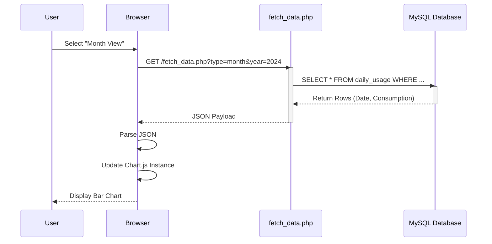
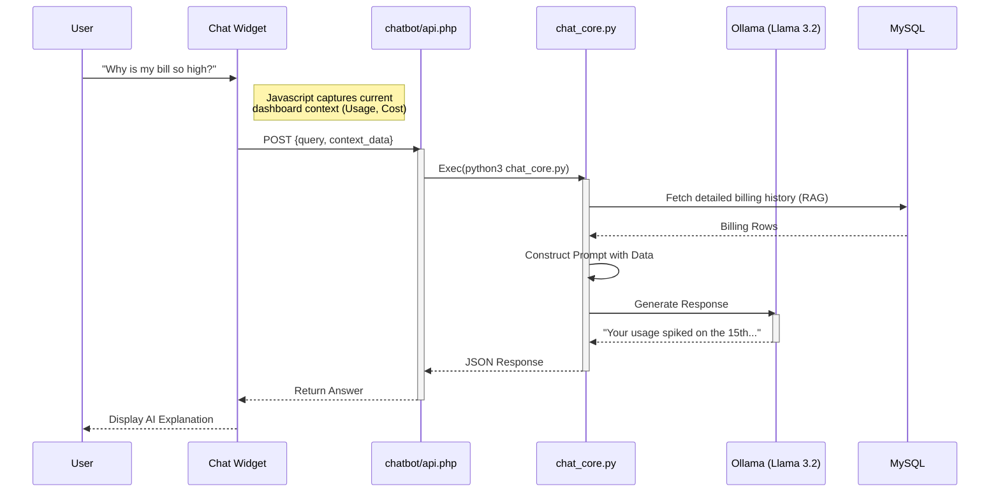

# User Interface & Experience (UI/UX) Flows

## 1. User Journey Overview

This flowchart illustrates the typical user interaction path, from logging in to analyzing data and seeking AI support.

```mermaid
graph TD
    Start([User Access]) --> Login{Authenticated?}
    Login -- No --> PageLogin[login.php]
    PageLogin --> Login
    Login -- Yes --> Dash[Dashboard/index.php]

    Dash --> ViewStats[View Statistics]
    Dash --> ViewBill[Check Billing]

    ViewStats --> Charts[Render Charts (Chart.js)]
    ViewBill --> Payment[Payment Gateway]

    subgraph "AI Assistant Loop"
        Dash --> AskAI[Open Chat Widget]
        AskAI --> Query[Ask: 'Why is bill high?']
        Query --> AI_Proc[AI Analysis]
        AI_Proc --> Explain[Receive Explanation]
    end

    Explain --> Dash
```

## 2. Data Visualization Sequence

This diagram details how the system renders the "Daily Consumption" and "Cost Estimates" charts.



## 3. AI Chatbot Support Workflow

This sequence demonstrates the "Context-Aware" support flow where the Chatbot uses real billing data to answer user questions.


